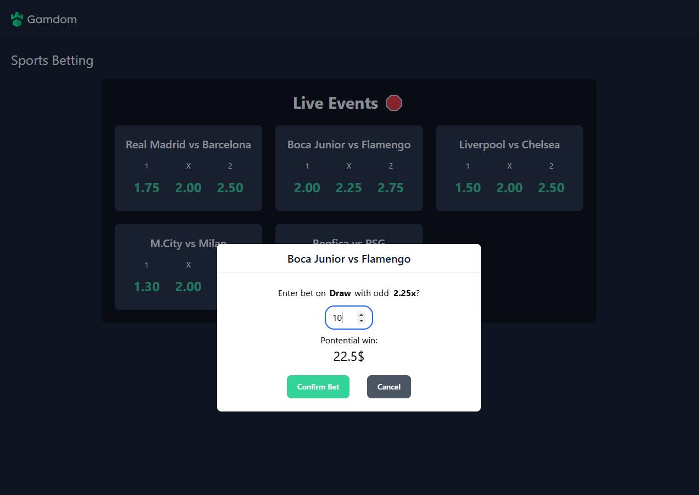
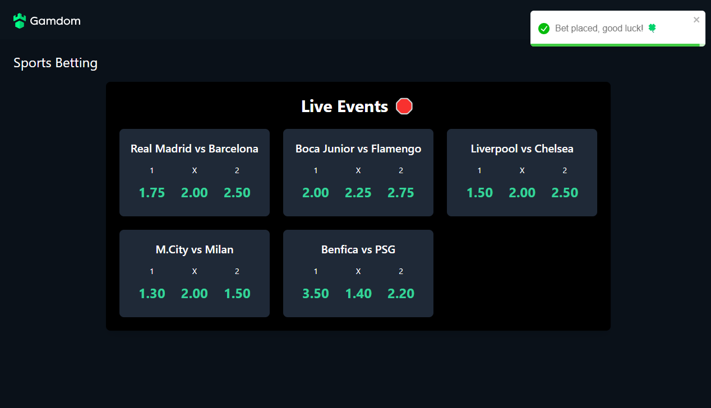

# Gamdom-Sports-Betting

**Gamdom-Sports-Betting** is a sports betting application

This repository provides a local development environment setup using Docker Compose, with a couple of commands to get the application up and running with hot-reload.
---

## Prerequisites

Before running the application, ensure you have the following installed and running on your system:
- [Docker](https://www.docker.com/)
- [Docker Compose](https://docs.docker.com/compose/)

---

## Project Structure

- **frontend**: React app located in the `gamdom-sports-betting` directory.
- **backend**: Node.js app with Express located in the `gamdom-sports-betting-backend` directory.
- **db**: PostgreSQL database running in a Docker container.

---

## Docker Compose Configuration

### File: `docker-compose.yml`

The app is configured using Docker Compose version `3.8`. The configuration defines three services:

1. **Frontend**
    - Runs the React app and serves it on `http://localhost:5173`.
    - Watches for file changes in the `gamdom-sports-betting` directory.

2. **Backend**
    - Runs the Node.js Express API on `http://localhost:3000`.
    - Connects to the PostgreSQL database.

3. **Database**
    - A PostgreSQL instance running on `localhost:5432`.
    - Uses environment variables for user, password, and database name.

---

## Running the Application Locally

1. **Clone the Repository**
   ```bash
   git clone https://github.com/Buyachaka/gamdom-fs-interview
   cd gamdom-sports-betting
   docker-compose build
   docker-compose up
   Access the frontend at http://localhost:5173
   Enter the following credentials to login:
    Username: admin
    Password: admin
   ```
   
## Screenshots

1. **Login Page** 


2. **Bet Pop-up**


3. **Bet Confirmed**

